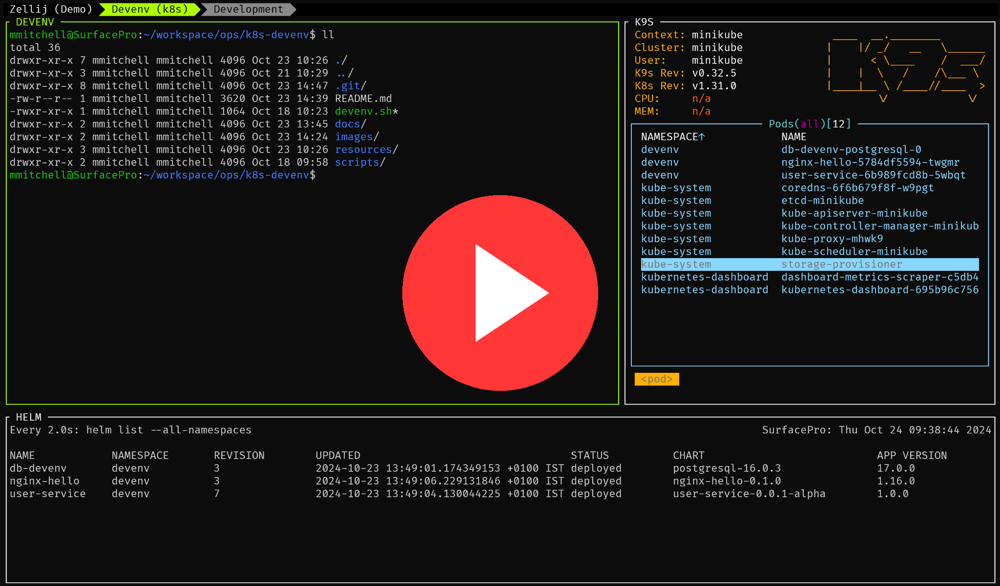

# Kubernetes Development Environment (k8s-devenv)

A Kubernetes development environment.

<table style="border: none; border-collapse: collapse; width: 100%;">
  <tr>
    <td>
      
    </td>
    <td>
      <strong>Click on the image for demo video</strong>
    </td>
  </tr>
</table>


## Overview

A Kubernetes development environment provides a local setup for developing, testing, and debugging Kubernetes-based applications. This guide will help you set up and configure all necessary tools to create an efficient workflow.

## Prerequisites

This environment depends on the following tools, which are essential for running Kubernetes locally and managing your environment:

- Unix OS
- [Minikube](https://minikube.sigs.k8s.io/)
- [kubectl](https://kubernetes.io/docs/tasks/tools/#kubectl)
- [Helm](https://helm.sh/)
- [Skaffold](https://skaffold.dev/)

For detailed setup instructions, refer to [prerequisites.md](docs/prerequisites.md)


## Devenv Environment Setup

todo: update this to show cmd and link to details...

Follow the instructions in [setup-devenv.md](docs/setup-devenv.md) to set up your local Kubernetes cluster. The deployed services are primarily Spring Boot applications built using Gradle. Note that the provided setup script is idempotent, meaning it can safely be re-run to update services to their latest versions or redeploy the original configuration.

## Useful complementary tools

These tools are not required but can enhance your development experience:

- [zellij](https://zellij.dev/) - Terminal multiplexer for managing multiple terminal windows.
- [k9s](https://k9scli.io/) - A terminal-based UI to interact with Kubernetes clusters.
- [kubectx](https://github.com/ahmetb/kubectx) - A tool to switch between Kubernetes contexts easily.
- [kubens](https://github.com/ahmetb/kubectx) - A tool to switch between Kubernetes namespaces.

For more information on setting up these tools, refer to [optional-tooling.md](docs/optional-tooling.md)

## How to use this development environment

### Kubernetes Dashboard


Run the following command to access the Kubernetes Dashboard:

```shell
minikube dashboard
```

Then, navigate to the provided URL.

### Deploying code

The environment uses **Skaffold** as a tool to package and deploy source code directly into the local k8s cluster. Each project contains a `skaffold.yaml` definition file that tells Skaffold how to handle local deployments (see example `skaffold.yaml` [here](https://github.com/mm-camelcase/user-service/blob/main/skaffold.yaml))

#### Deploying Pod Resources

Resource deployments use Helm-style Skaffold configs (i.e. Skaffold generates Helm install and update commands).

To deploy source code (assuming code is build first using `./gradlew clean build`) into the local cluster, run the following command from the same location as the `skaffold.yaml` definition file:

```shell
skaffold run --port-forward
```

or Skaffold can monitor your source code for changes using...

```shell
skaffold dev --port-forward
```


### Debugging code

To deploy a service in debug mode, run:

```shell
skaffold debug
```

The deploy will automatically set up a port foward for debugging on port `5005`. Configure your debugger as a remote JVM debugger (e.g. in IntelliJ):


### Update the cluster

To update services to the latest available versions, simply run the setup script again. Since the script is idempotent, it will redeploy or update without causing conflicts.

### Delete the cluster

The setup script is idempotent, but if you want to remove all traces of your cluster and start over, you can run:

```shell
minikube delete
```

## Notes

- mention scripts are idempotent
- run devenv.sh again to redeploy orig
- click and go
- tool to pretify scripts
- mention services are spring boot * gradle

